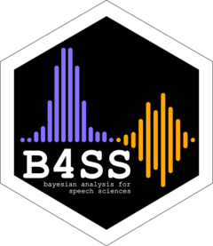

<!-- README.md is generated from README.Rmd. Please edit that file -->

```{r, include = FALSE}
knitr::opts_chunk$set(
  collapse = TRUE,
  comment = "#>",
  fig.path = "man/figures/README-",
  out.width = "100%"
)
```

# Learn Bayesian Analysis for the Speech Sciences 

<!-- badges: start -->
`r badger::badge_custom("version", badger::ver_devel(), color = "FFA70B")`
<!-- badges: end -->


Here you can find the learning materials for the workshop **Learn Bayesian Analysis for the Speech Sciences** (learnB4SS), in the form of an R package.

We will add more info here soon and instructions to install this package, so stay tuned!

For now, you can have a look at the [FAQs page](https://learnb4ss.github.io/learnB4SS/articles/faqs.html) and make sure you have gone through the installation of brms [here](https://learnb4ss.github.io/learnB4SS/articles/install-brms.html).

If you wish and haven't done it yet, you can join us on **Slack** (link and instructions have been provided via email).


