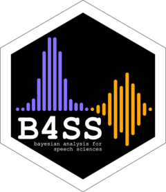

<!-- README.md is generated from README.Rmd. Please edit that file -->

# Learn Bayesian Analysis for the Speech Sciences 

### Learning materials

<!-- badges: start -->

<!-- badges: end -->

Here you can find the **learning materials** for the workshop *Learn
Bayesian Analysis for the Speech Sciences*
([learnB4SS](https://learnb4ss.github.io)), in the form of an R package.

For dates and other info, see the workshop
[homepage](https://learnb4ss.github.io).

## Let’s get started!

### Prerequisites

The first step is to install brms and its dependencies. If you haven’t
yet done so, check out the installation instructions
[here](https://learnb4ss.github.io/learnB4SS/articles/install-brms.html).

### Workshop materials

To save you some hassle, we created a Starter Kit, which you can
download from here: [Go to download
page](https://github.com/learnB4SS/learnB4SS-kit).

The download page also contains instructions to get you set up.

**NOTE**. The kit is just a convenient way of setting up an RStudio
project that you can use during the workshop. If you are comfortable
with RStudio, you can choose to set up your own RStudio project instead
of downloading this kit. If you choose not to use the Starter Kit, you
can just follow the [installation instructions for the learnB4SS
package](https://learnb4ss.github.io/learnB4SS/articles/install-learnb4ss.html).
Note that this package and materials are best used from RStudio.

## Check list

Here is a summary of all the prepping steps.

-   [x] Install **brms and dependencies** (essential).
-   [x] Download the **Starter Kit** (optional) and **install
    learnB4SS** (essential).
-   [x] Hang out with us on **Slack** (link and instructions have been
    provided via email).
-   [x] Prepare some **snacks and refreshments** to keep your energy up
    during the workshop (unfortunately we can’t provide those).
