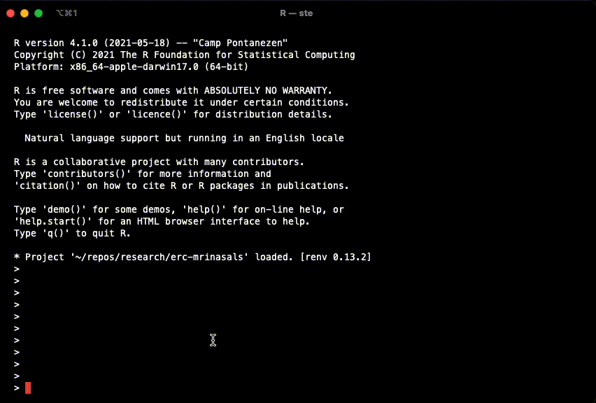

```{r setup, include = FALSE}
knitr::opts_chunk$set(
  collapse = TRUE,
  comment = "#>",
  echo = TRUE, eval = FALSE
)
```

# Introduction

When you fit a model with brms, the package calls [Rstan](https://mc-stan.org/users/interfaces/rstan) which is an R interface to the statistical programming language [Stan](https://mc-stan.org).

The nice thing about brms is that it uses a syntax for specifying model formulae that is based on the syntax of the commonly known lme4 package.
The lme4-like syntax of brms is converted into Stan code automatically, so you won't have to learn Stan.^[brms is *very* flexible, but if you need to fit highly customised models (e.g., ...), then learning Stan is recommended. It is possible to get the Stan code from the brms syntax and modify it to your liking before running it, all from within R.]

Stan is built in the programming language C++ and models have to be compiled using C++ to be run.
This is all taken care of by brms, so you just need to run `brm(...)` and brms will do its magic.

However, since the models have to be compiled in C++, you need to set up your computer so that it can use C++.
This has to be done only once, before installing brms, and the procedure depends on your operating system.
Continue reading for detailed instructions.

# Getting help

**If you get stuck** at any point in the installation process, please contact us at learnb4ss@gmail.com as soon as possible.
<u>*It is of out-most importance that by the start of the workshop everything works fine on your computer*</u>, so we very strongly recommend to go through the installation process as early as possible (e.g. at least two weeks prior to the workshop).

# R and RStudio

⚠️ **IMPORTANT!** We <u>**very strongly**</u> recommend you to **update R to 4.x and RStudio to the latest** release.
This combo will ensure a smoother installation process and use.
We will not be able to provide support for R versions earlier than 4.0.

To **install/update R**, find the installation disk depending on your operating system here: <https://cloud.r-project.org>. (If you have macOS with an M1 chip, make sure to install R 4.1.0 for arm64)

We also highly recommend installing RStudio, as we will provide you with interactive RMarkdown files as additional resources that are best viewed and used in RStudio.
Please, **download RStudio** or update it to the latest version: <https://www.rstudio.com/products/rstudio/download/#download>.

The following sections explain how to configure and install further software that will be necessary for workshop activities.
The instructions vary depending on your operating system, so check out the section that is relevant to you.
You will perform the following steps:

1. Configure the C++ toolchain (needed for Stan).
2. Install Rstan (and Stan).
3. Install brms.

# macOS

## Configure the C++ toolchain

To configure the C++ toolchain on macOS, you just need to install the Xcode Command Line Tools and `gfortran`.

First, if you have the files `~/.R/Makevars` and/or `~/.Renviron`, save a copy in a different location (like your desktop) and delete them.

If you don't know what these files are or if you have them, go to `Finder > Go > Home`, which takes you to your home directory, and press `SHIFT + CMD + .` to show hidden files (i.e. files starting with a full stop `.`) if you can't see them already.
Now search among the hidden files and if you see a folder named `.R/` and/or a file `.Renviron`, copy them to your desktop and delete the original copies from your home directory.

If you have important configurations you want to keep, you can try to put the files back **after** you completed the installation of brms and checked that everything works fine.

To install the **Xcode Command Line Tools**, run the following in the Terminal (open `Finder > Applications > Terminal`, type in the following command and press `ENTER`):

```
xcode-select --install
```

macOS will download and install the Xcode CLT (it will take a while, make sure you have a stable internet connection).

If your Mac has an Intel chip, you need to install **gfortran v8.2** (for Mojave) <u>**independent of your macOS version**</u>.
You can download the installer from <https://github.com/fxcoudert/gfortran-for-macOS/releases/tag/8.2>.

If your Mac has an Apple M1 chip, you will need to install **gfortran v11**. You can download it from here: <https://github.com/fxcoudert/gfortran-for-macOS/releases/tag/11-arm-alpha2> (download the `.pkg` package listed under Assets at the bottom of the page).

Now you can set some compiler optimisations to improve compilation speed (optional).
In the R console, run:

```r
dotR <- file.path(Sys.getenv("HOME"), ".R")
if (!file.exists(dotR)) dir.create(dotR)
M <- file.path(dotR, "Makevars")
if (!file.exists(M)) file.create(M)
cat("\nCXX14FLAGS += -O3 -mtune=native -arch x86_64 -ftemplate-depth-256",
    file = M, sep = "\n", append = FALSE)
```

## Install Rstan

Just in case you previously tried to install Rstan without success, run the following code to clean installations and configuration files.

```{r}
remove.packages("rstan")
if (file.exists(".RData")) file.remove(".RData")
```

Restart R.

Assuming you are using R 4.0 or later, just run in the R console:

```{r}
install.packages("rstan")
```

Now, verify the installation by running:

```{r}
example(stan_model, package = "rstan", run.dontrun = TRUE)
```

If the model compiles and starts sampling like in the gif below, you are set.

```{r rstan-gif, echo=FALSE, out.width="400px", eval=TRUE, fig.align='center'}

```


In case you get the following warning, it is safe to ignore it.

```{r}
# Warning message:
# In system(paste(CXX, ARGS), ignore.stdout = TRUE, ignore.stderr = TRUE) :
#  'C:/rtools40/usr/mingw_/bin/g++' not found
```

## Install brms

Install brms from CRAN simply with:

```{r}
install.packages("brms")
```

🎉 Congrats! You are now ready to run Bayesian regressions.

# Windows

## Configure the C++ toolchain

To configure the C++ toolchain, follow the instructions here for your R version (3.6 or 4.0): <https://github.com/stan-dev/rstan/wiki/Configuring-C---Toolchain-for-Windows>.

## Install Rstan

Just in case you previously tried to install Rstan without success, run the following code to clean installations and configuration files.

```{r}
remove.packages("rstan")
if (file.exists(".RData")) file.remove(".RData")
```

Restart R.

Then just run:

```{r}
install.packages("rstan", repos = "https://cloud.r-project.org/", dependencies = TRUE)
```

Now, verify the installation by running:

```{r}
example(stan_model, package = "rstan", run.dontrun = TRUE)
```

If the model compiles and starts sampling like in the gif below, you are set.

```{r rstan-gif-2, echo=FALSE, out.width="400px", eval=TRUE, fig.align='center'}

```

In case you get the following warning, it is safe to ignore it.

```{r}
# Warning message:
# In system(paste(CXX, ARGS), ignore.stdout = TRUE, ignore.stderr = TRUE) :
#  'C:/rtools40/usr/mingw_/bin/g++' not found
```

## Install brms

Install brms from CRAN simply with:

```{r}
install.packages("brms")
```

🎉 Congrats! You are now ready to run Bayesian regressions.

# Linux

## Install Rstan and configure the C++ toolchain

On Linux, you have the option to install a pre-built Rstan binary or to build it from source.

If you decide to install the **pre-built binary**, follow the instructions here: <https://github.com/stan-dev/rstan/wiki/Configuring-C-Toolchain-for-Linux>, and you will have Rstan.

If you would rather **build it from source**, then:

- follow the instructions here (as above): <https://github.com/stan-dev/rstan/wiki/Configuring-C-Toolchain-for-Linux>- and then build from source by following the instructions here: <https://github.com/stan-dev/rstan/wiki/Installing-RStan-from-Source#linux>

## Install brms

Install brms from CRAN simply with:

```{r}
install.packages("brms")
```

🎉 Congrats! You are now ready to run Bayesian regressions.
